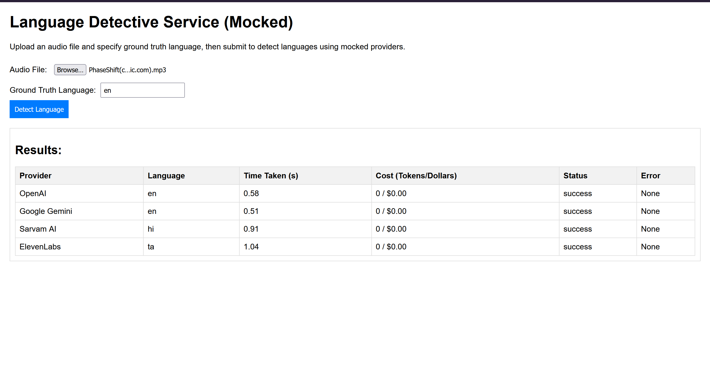

# Language Detective Service

A FastAPI-based service to detect spoken languages in audio files using mocked connectors for OpenAI, Google Gemini, Sarvam AI, and ElevenLabs. Features a web UI for file upload and result display, with files saved to an `audio_files/` directory. Designed for the DripLink BE Intern Assignment.

## Project UI


## Project Structure

```
language_detective_service/
├── connectors/
│   ├── __init__.py
│   ├── openai_connector.py
│   ├── gemini_connector.py
│   ├── sarvam_connector.py
│   └── elevenlabs_connector.py
├── coordinator.py
├── main.py
├── templates/
│   └── index.html
└── audio_files/  # Stores uploaded audio files
```

## Features

- **Web UI**: Upload audio files (MP3/WAV) and specify ground truth language at http://127.0.0.1:8000/.
- **API Endpoint**: POST `/detect/language` handles file uploads and returns mocked language detection results.
- **Mocked Connectors**: Simulate OpenAI, Google Gemini, Sarvam AI, and ElevenLabs with fake responses (e.g., "en", "hi", "ta").
- **File Storage**: Uploaded files are saved to `audio_files/`.
- **Error Handling**: Robust handling of file and API errors.
- **Indian Language Support**: Mocked responses include Hindi ("hi") and Tamil ("ta") for bonus points.

## Requirements

- Python 3.10+
- Libraries: `fastapi`, `uvicorn`, `pydantic`, `jinja2` , `python-multipart`

## Setup Instructions

### 1. Clone or Create Project Directory

```bash
git clone https://github.com/555vedant/LanguageDetection.git
```

### 2. Set Up Virtual Environment

```bash
python -m venv venv
source venv/bin/activate  # On Windows: venv\Scripts\activate
```

### 3. Install Dependencies

```bash
pip install fastapi uvicorn pydantic jinja2
```

### 4. Create Audio Files Directory

```bash
mkdir audio_files
```

### 5. Run the Server

```bash
uvicorn main:app --reload
```

## Usage

### Access UI

1. Open http://127.0.0.1:8000/ in a browser.
2. Upload an audio file (MP3/WAV, real or dummy—content ignored due to mocks).
3. Enter ground truth language (e.g., "en").
4. Submit to view mocked results in a table.

### Test API Directly (optional)

```bash
curl -X POST http://127.0.0.1:8000/detect/language \
  -F "file=@/path/to/audio.mp3" \
  -F "ground_truth_language=en"
```

## Notes

- **Mocked Implementation**: No real APIs used; all connectors return fake data (languages, timings, zero costs).

